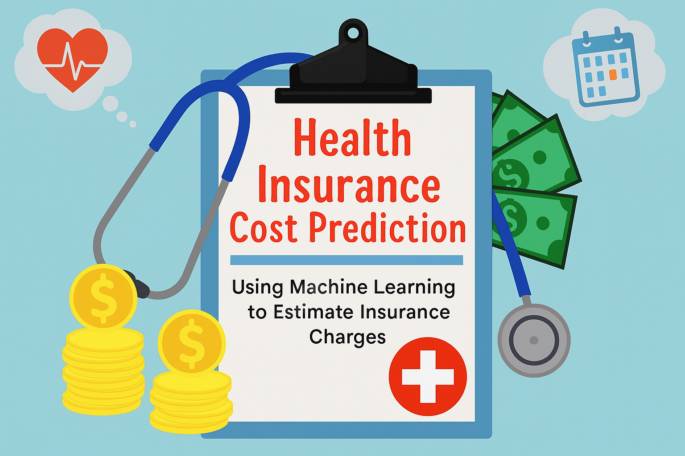
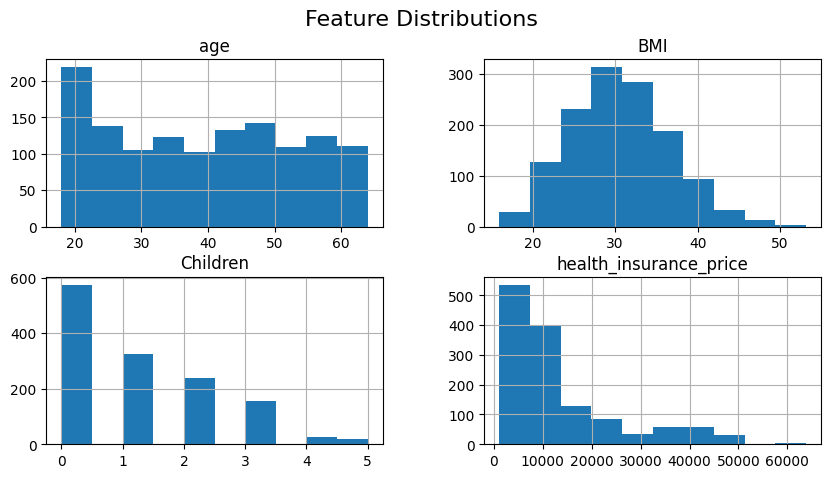
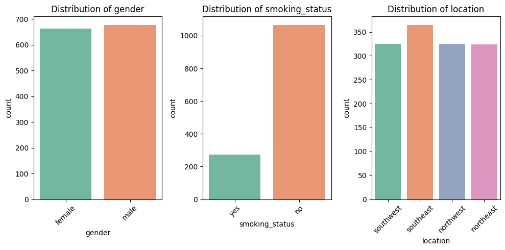
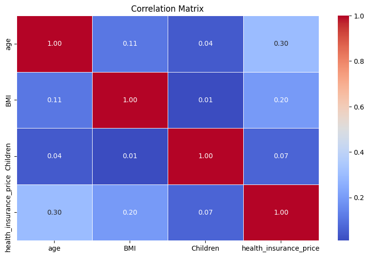
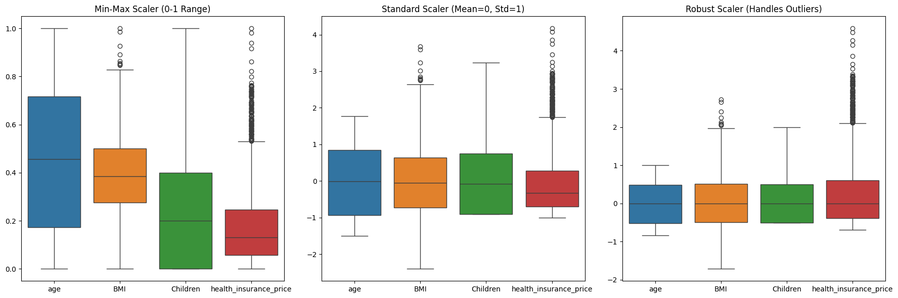
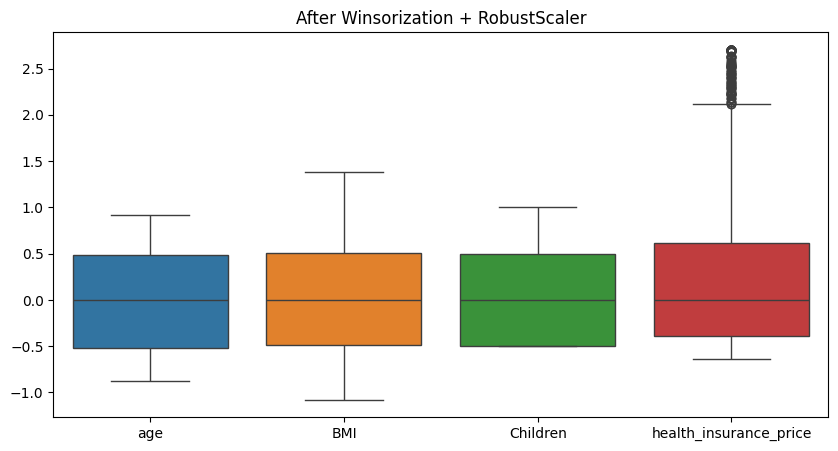
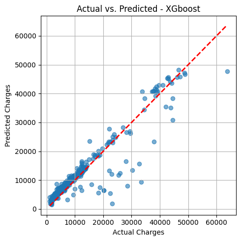
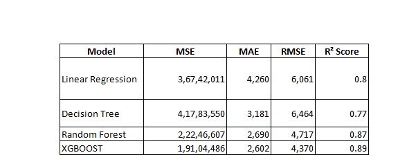

# Health Insurance Cost Prediction Using Machine Learning


### 📌 Project Overview
Health insurance cost prediction is a critical challenge in the healthcare and insurance industries. Accurately estimating a customer’s medical expenses based on lifestyle and demographic factors allows insurance providers to manage risk more effectively, set fair premium rates, and offer personalized plans.

In this project, I developed a robust machine learning pipeline that predicts medical insurance charges using a structured dataset containing variables such as age, sex, BMI, smoking status, and region. The process involved exploratory data analysis (EDA), feature engineering, preprocessing, and regression modeling using multiple algorithms.

---

### 🎯 Objective

To develop a regression model that predicts individual medical insurance charges using demographic and lifestyle features, applying advanced machine learning techniques, with a focus on model interpretability and accuracy.

---
### 📁 Data Description

The dataset contains **1338 records** and **7 features**:

| Feature               | Description                                              |
|-----------------------|----------------------------------------------------------|
| `age`                | Age of primary beneficiary                               |
| `gender`             | Gender of the insured (male/female)                      |
| `bmi`                | Body Mass Index                                          |
| `children`           | Number of dependents                                     |
| `smoking_status`     | Smoking habit (yes/no)                                   |
| `location`           | Residential area (northeast, southeast, southwest, northwest) |
| `health_insurance_price` | Target variable: individual medical costs billed by insurance |

### 🎯 Target Variable
**health_insurance_price** – A continuous variable representing the total medical cost charged to the insurance provider.

### **Features (Independent Variables):**

* Demographics: age, gender

* Lifestyle: BMI, smoking status

* Family structure: number of children

* Location: region (to account for regional cost variability)

---
###  Project Workflow

Here is a step-by-step breakdown of all tasks performed:

### 1. **Importing Libraries and Dataset**
- Loaded essential Python libraries: pandas, numpy, matplotlib, seaborn, and xgboost.
- Imported the dataset and reviewed its structure.

### 2. **Initial Data Exploration**
- Used `.info()` and `.describe()` to understand data types and basic statistics.
- Checked for null values and confirmed that the dataset is having missing values.

### 3. **Exploratory Data Analysis (EDA)**
- Univariate Analysis: Distribution plots for numerical features

- Categorical Analysis: Count plots for categorical features

- Multivariate Analysis: Boxplots, correlation heatmap

### 4. **Data Preprocessing**
- Converted categorical columns (`sex`, `smoker`, `region`) into numerical format using **Label Encoding**.
- Verified data types post-encoding and ensured no missing/inconsistent values.
- Checked for outliers using boxplots and visualized skewness of numerical features.

### 5. **Feature Engineering**
- Created new BMI category feature: Underweight, Normal, Overweight, Obese.
- Attempted polynomial features (if applicable).
- Selected key features for model training based on correlation and visual analysis.

### 6. **Train-Test Split**
- Split the data into **80% training** and **20% testing** using `train_test_split` from `sklearn`.

### 7. **Model Building**
Built and compared multiple regression models:
- **Linear Regression**
- **Decision Tree Regressor**
- **Random Forest Regressor**
- **XGBoost Regressor** (Final chosen model)

### 8. **Model Evaluation**
Evaluated each model using:
- **R² Score**
- **Mean Absolute Error (MAE)**
- **Mean Squared Error (MSE)**
- **Root Mean Squared Error (RMSE)**

### 9. **Hyperparameter Tuning**
- Tuned the XGBoost model using parameters like `n_estimators`, `max_depth`, and `learning_rate` for optimal performance.

### 10. **Model Interpretation**
- Analyzed **feature importance** from the XGBoost model to identify which variables most influenced predictions.
- Visualized predicted vs. actual charges.

---

### 📊 Data Visualizations

###  Histogram – Numeric Columns


###  Countplot – Categorical Columns


###  Boxplot – Outlier Detection


###  Correlation Heatmap


###  Scaling Techniques Comparison


###  Outlier Capping


### Scatter Plot – Actual vs Predicted Charges


---
### Model Performance Comparison



This table compares the performance of four machine learning models — Linear Regression, Decision Tree, Random Forest, and XGBOOST — using key evaluation metrics: Mean Squared Error (MSE), Mean Absolute Error (MAE), Root Mean Squared Error (RMSE), and R² Score. Lower error values and higher R² scores indicate better performance. Among these, XGBOOST delivers the best overall results.

---

### 🔍 Key Findings
- **Smoking status** is the strongest predictor of higher medical charges.
- **BMI** and **age** significantly impact insurance cost—especially when BMI crosses the obesity threshold.
- Gender and region had minimal predictive power.
- **XGBoost** outperformed other models with the highest accuracy and generalization capability.

---

## 🧾 Final Report & Conclusion
This project showcases the complete lifecycle of a real-world ML regression task. XGBoost outperformed all models, and insights from feature analysis can aid insurance firms in designing data-driven pricing strategies.

---

## 🧰 Skills Demonstrated

- Data Cleaning & EDA  
- Feature Engineering  
- Regression Modeling  
- Model Evaluation  
- Hyperparameter Tuning  
- Reporting & Interpretation 

---

## 🛠️ Tools & Technologies Used

- **Languages**: Python
- **Libraries**: Pandas, NumPy, Matplotlib, Seaborn, Scikit-learn, XGBoost
- **Environment**: Jupyter Notebook

---

## 👨‍🎓 About Me

I hold a degree in **Electronics and Communication Engineering (ECE)** and have transitioned into **Data Science** by developing strong skills in Python, statistics, and machine learning. My technical foundation in mathematics and systems engineering helps me tackle complex data problems with clarity and precision.

---

## 🚀 How to Run This Project

1. Clone this repository:
   ```bash
   git clone https://github.com/Jerripothulavaishnavi/health-insurance-cost-prediction.git
   cd health-insurance-cost-prediction
